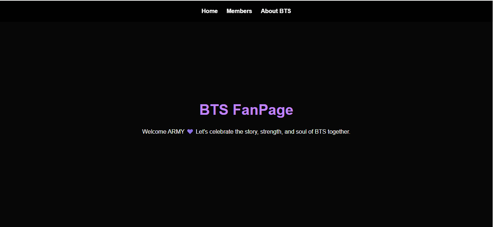

# BTS Fanpage Website 💜

## 📌 Project Description
This project is a **BTS Fanpage website** created to celebrate the global K-pop group BTS and their journey.  
The website introduces BTS, highlights the members, and welcomes fans (ARMY) to explore their story.

The goal of this project was to practice **HTML, CSS, and responsive web design using media queries**.

---

## 🚀 Features
- A homepage introducing BTS and welcoming fans
- A section explaining BTS and their journey
- A members section displaying BTS members
- Responsive design that adapts to **desktop, tablet, and mobile screens**

---

## 🛠️ Technologies Used
- **HTML5**
- **CSS3**
- **Media Queries (Responsive Design)**

---

## 📱 Responsive Breakpoints
The website adjusts to different screen sizes using media queries:

- **1024px** – Small laptops / large tablets  
- **768px** – Tablets  
- **480px** – Mobile phones  

---

## 🌐 Live Website
You can view the website here:

[View the BTS Fanpage](https://madu-olivia.github.io/New-Fanpage/)

---

## 📷 Screenshot

---

## 📚 What I Learned
While building this project, I learned how to:

- Structure a webpage using **HTML**
- Style layouts using **CSS**
- Use **media queries** to make websites responsive
- Organize images and sections on a webpage
- Build a simple multi-section fanpage

---

## 👩🏽‍💻 Author
**Olivia Madu**

Beginner Frontend Developer
